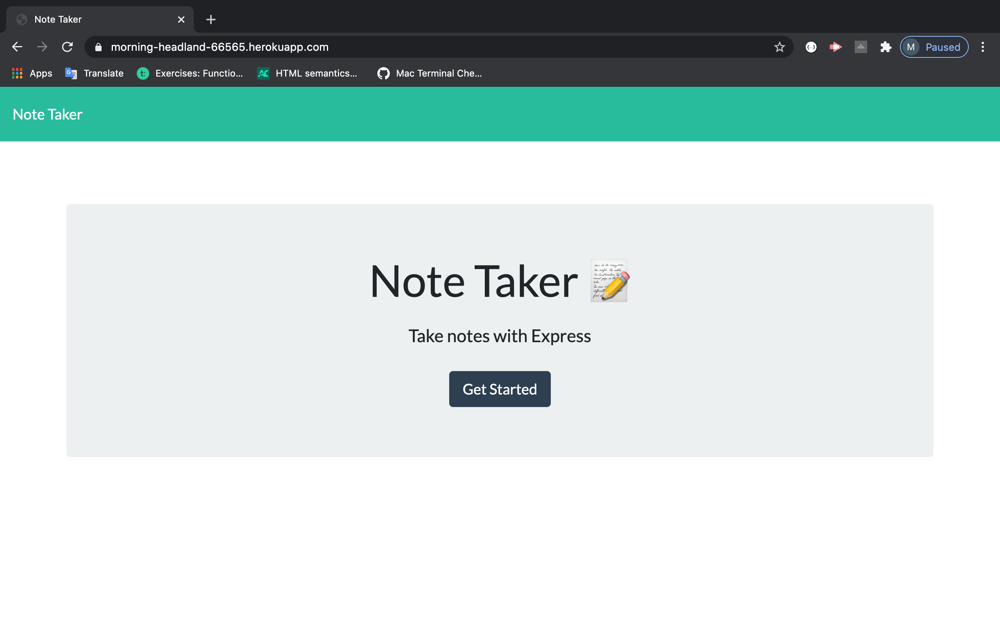
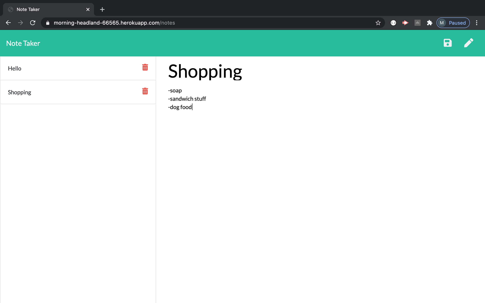

<h1 align="center">Note Taker</h1>

## Description
A note taking application allows you to save and delete notes that you may have for the day.

<iframe src="https://drive.google.com/file/d/1XG3ub8tpNWf4608M_h_v00uSRcNCr_ZO/preview" width="640" height="480"></iframe>

## Table Of Contents
  - [Description](#discriptionOfProject)
  - [Installation](#installationOfProject)
  - [Usage](#usageOfProject)
  - [License](#licenseOfProject)
  - [Test](#testOfProject)
  - [Issues](#issuesOfProject)
  - [Contributors](#contributorsOfProject)

 
 

## Installation
Node Express

## Usage
Can be used to keep track of daily notes and add or delete as needed to keep yourself up to date with whatever you have goin on.

## License
MIT

This application is covered by the MIT license.

## Test
No test included

## Issues
Responding where I needed return and returning where I needed respond.

## Contributors
Just myself, Michael Griffith

# Github
  GriffMike167

# Email
  griffithcmichael@gmail.com

